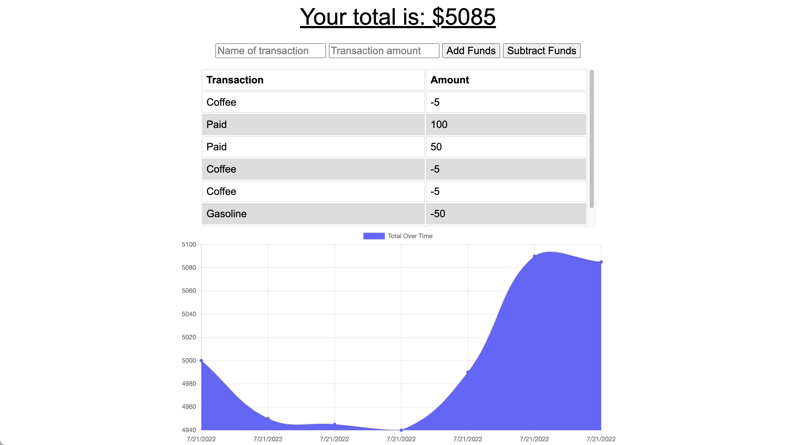

# Budget Tracker

### This application focuses saving transactions to an IndexedDB object store when the server cannot connect to the internet. The transactions are posted in a bulk request when the website connects to the internet again.

# Stack

IndexedDB, Express, MongoDB, Morgan, Compression

### Demo the App - [https://mp-budget-tracker.herokuapp.com/](https://mp-budget-tracker.herokuapp.com/)

Watch a walkthrough of how to use the application here: [https://youtu.be/0de0K9een8c](https://youtu.be/0de0K9een8c)

# Installation

### `npm i`

## Available Scripts

In the project directory, you can run:

### `npm start`

Open [http://localhost:3001](http://localhost:3001) to view it in your browser.
